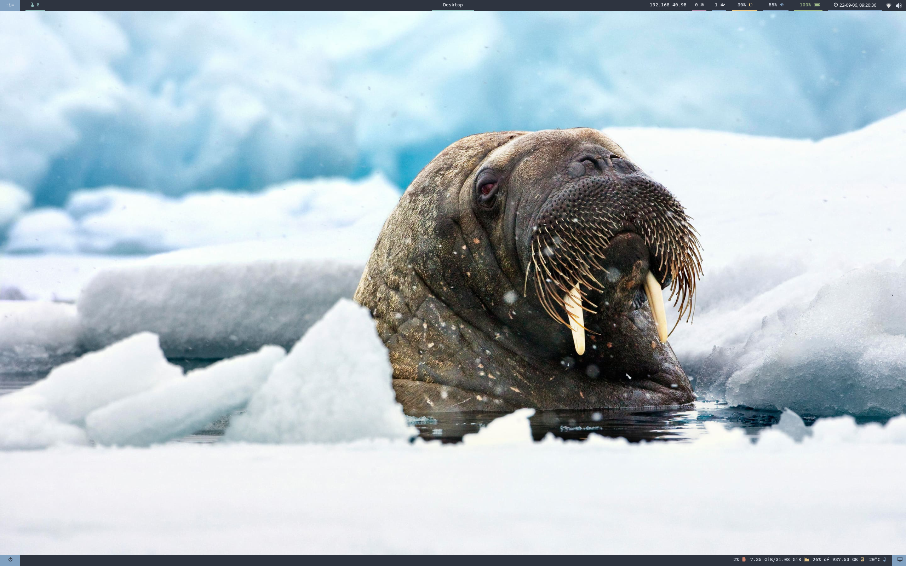

# polybar-nord



## Requirements

- `polybar` >= 3.6.0

## Modules

### Top bar

- **module/rofi** | custom/text module
- **module/i3** | internal/i3 module | [wiki](https://github.com/polybar/polybar/wiki/Module:-i3)

- **module/title** | internal/xwindow module | [wiki](https://github.com/polybar/polybar/wiki/Module:-xwindow)

- **module/network-detail** | internal/network module | [wiki](https://github.com/polybar/polybar/wiki/Module:-network)
- **module/docker** | custom/script module | [github repository](https://github.com/kerwanp/polybar-script-docker)
- **module/backlight** | internal/backlight module | [wiki](https://github.com/polybar/polybar/wiki/Module:-backlight)
- **module/alsa** | internal/alsa module | [wiki](https://github.com/polybar/polybar/wiki/Module:-alsa)
- **module/battery** | internal/battery module | [wiki](https://github.com/polybar/polybar/wiki/Module:-battery)
- **module/date** | internal/date module | [wiki](https://github.com/polybar/polybar/wiki/Module:-date)

- **module/arandr** | custom/text module

### Bottom bar

- **module/powermenu** | custom/menu module | [wiki](https://github.com/polybar/polybar/wiki/Module:-menu)

- **module/cpu** | internal/cpu module | [wiki](https://github.com/polybar/polybar/wiki/Module:-cpu)
- **module/memory** | internal/memory module | [wiki](https://github.com/polybar/polybar/wiki/Module:-memory)
- **module/temperature** | internal/temperature module | [wiki](https://github.com/polybar/polybar/wiki/Module:-temperature)
- **module/show-desktop** | custom/text module

## Usage

Copy the [src folder](src) into your [~/.config/polybar folder](~/.config/polybar).

You can change the [config](config) to match the polybars with your system ([follow this guide](./modules-configuration.md)).

Use the [launch.sh script](launch.sh) to start your polybars.

```bash
bash launch.sh DP-1 eDP-1 HDMI-1
```

## File description

- [colors](colors)
    the polybar colors (see the [nord colorscheme](https://www.nordtheme.com/))
- [bars-config](bars-config)
    the bars configuration
- [bottom-bar](bottom-bar)
    the bottom bar modules configuration
- [top-bar](top-bar)
    the top bar modules configuration
- [config](config)
    the global configuration
- [launch.sh](launch.sh)
    this script is used to launch the polybars

## Inspiration

- [polybar-nord-theme](https://github.com/Yucklys/polybar-nord-theme)